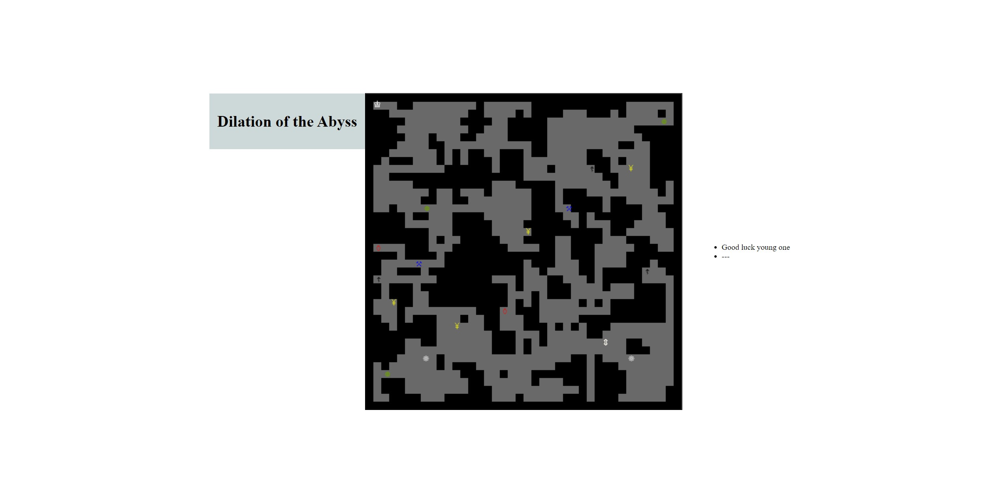

### React-Game

# Description

This is a fun roguelike game that lets the players adventure through a canvas like box usinf npm riot-js to build the world. You can pickup items along your adventure and encounter monsters as well (careful out there). I coded this app following and learning from a tutorial from Morgan Page. Morgan Page has many classes available on SkillShare. Please checkout his videos and show him some support. 

# Why a roguelike game?

Coding a roguelike game is  a great way to learn the fundamentals of React, Hooks and useful generic game concepts like movement, combat and inventories.

The game includes:

React
Hooks
Javascript
ES6
Classes
Arrays
Functions
Objects
Node.js

# Teacher/ Instructor

Morgan Page: [GitLab](https://gitlab.com/morganpage)

## Heroku Link

https://warm-journey-61693.herokuapp.com/

## screenshot

## Available Scripts

In the project directory, you can run:

### `npm start`

Runs the app in the development mode.\
Open [http://localhost:3000](http://localhost:3000) to view it in the browser.

The page will reload if you make edits.\
You will also see any lint errors in the console.

### `npm test`

Launches the test runner in the interactive watch mode.\
See the section about [running tests](https://facebook.github.io/create-react-app/docs/running-tests) for more information.

### Author

Steve E Hernandez